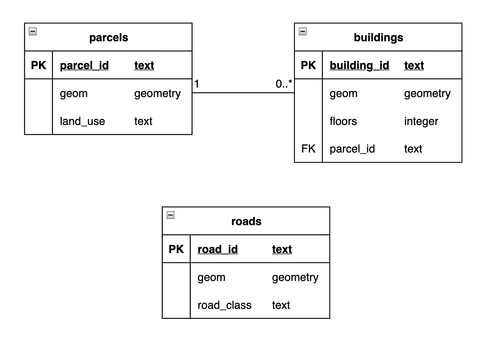

# Laboratory 6: Introductory Spatial Database Modeling

## Contents
- [Required Dependencies](#required-dependencies)
- [Verify PostgreSQL Installation](#verify-postgresql-installation)
- [Troubleshooting](#troubleshooting)
- [Persistence Decision Table](#persistence-decision-table)
- [The Entity-Relationship Diagram](#the-entity-relationship-diagram)
- [Reflections](#reflections)
- [Author Information](#-author)

## Required Dependencies
Before starting, make sure that you have installed the following dependencies:

- **[PostgreSQL 18](https://www.postgresql.org/download/macosx/)**
- PostGIS
- `psql` (included with PostgreSQL) and [pgAdmin 4](https://www.pgadmin.org/)
- *(Optional)* **[VSCode](https://code.visualstudio.com/)**

## Directory Structure
```text
├── diagrams/                       # Design Documentation
│   └── lab6_relational_model.png       # ER diagram for the Lab 6 database model
├── evidence/                       # Contains evidences of SQL commands
│   └── query_results.md                # Documentation of query results
├── sql/                            # SQL commands
│   ├── 01_schema.sql                   # Database schema definition
│   ├── 02_seed.sql                     # Seed data
│   └── 03_queries.sql                  # Sample queries
├── .gitignore                      # Ignored folders/files
└── README.md                       # Project overview, setup, and usage instructions
```

## Verify PostgreSQL Installation

Check PostgreSQL version:

```bash
psql --version
```
You should see something like:

> psql (PostgreSQL) 18.6 (Homebrew)

List databases:

```bash
psql -l
```

At minimum you should see `postgres`, `template0`, and `template1`:

``` text
                         List of databases
   Name    |     Owner     | Encoding | ...
-----------+---------------+----------+----
 postgres  | youruser      | UTF8     | ...
 template0 | youruser      | UTF8     | ...
 template1 | youruser      | UTF8     | ...
```
Use the default database `postgres`:
```bash
psql -d postgres
```
Inside `psql`:
```bash
SELECT current_database();
```
> This should show the current database name.
```bash
SELECT version();
```
> This should show the current version of PostgreSQL.
```bash
SELECT postgis_full_version();
```
> This should show a the current version of PostGIS and the installed extensions.
To exit `psql`:
```bash
\q
```

## Troubleshooting
| Problem | Likely cause and fix |
|---|---|
| `'psql' is not recognized as an internal or external command, operable program or batch file.` | By default, the PostgreSQL installer does not automatically add the command-line tools to your system's `PATH` environment variable. Add the PostgreSQL `bin` directory to your system Environment Variables. |
| `role "postgres" does not exist` | Homebrew creates a role named after your macOS user. Use that username in `psql` and pgAdmin. |
| PostGIS is not enabled. | Run the command `CREATE EXTENSION IF NOT EXISTS postgis;` |
| `extension "..." is not available` | The package isn't installed for your running PostgreSQL version. Check `pg_config --version` against `SHOW server_version;`. |
| `database "..." does not exist` | The database might not exist. You may run the `psql -l` command to check for existing databases. |

## Persistence Decision Table
> *Note*: The table has been restructured into **one row per attribute** format so that it is easier to map against the ERD.

| Object-model element | Persist? | Reason |
|---|---|---|
| `Parcel.parcel_id` | Yes | Identity must survive — used as the primary key for the Parcel table. |
| `Parcel.land_use` | Yes | Mapped attribute state must survive after the program stops. Can also be considered later on as a separate entity (e.g. `LandUse`) and will be referenced by the `Parcel` table through foreign key.|
| `Parcel.geom` | Yes | Mapped spatial state must survive after the program stops. |
| `Parcel.area()` | No | A behavior since area can be recalculated from the stored geometry whenever it's needed. |
| `Building.building_id` | Yes | Identity must survive — used as the primary key for the Building table. |
| `Building.floors` | Yes | Persistent domain attribute describing the building. |
| `Building.geom` | Yes | Persistent spatial state for the building. |
| `Building → Parcel relationship` | Yes | This relationship must be retained across restarts, so it requires a stored key reference (`parcel_id` as a foreign key on `Building`). |
| `Road.road_id` | Yes | Identity must survive — used as the primary key for the Road table. |
| `Road.road_class` | Yes | Persistent attribute describing the road's classification. Can also be considered later on as a separate entity (e.g. `RoadClass`) and will be referenced by the `Road` table through foreign key.|
| `Road.geom` | Yes | Persistent spatial state for the road. |
| `SpatialRule.evaluate(parcel)` | No | Rule-checking logic stays as application code; it is behavior, not data to store. |
| `RuleResult.rulename, passed, message` | Yes | Unlike a rule's logic, the outcome of evaluating a rule against a parcel is a fact worth keeping — it can't be regenerated later without re-running the exact same evaluation against the parcel's state at that point in time, so it must be stored if any history of past assessments is required. |

## The Entity-Relationship Diagram


## Running the SQL files

### Method 1: Using the Terminal
Run the SQL files from the root directory using the `psql` command-line utility with the `-f` flag.
``` bash
psql -U your_username -d your_database -f sql/sql_file.sql
```

### Method 2: Using the pgAdmin
1. Open the `query tool` of your specific database.
2. Click the `Open File` icon (folder symbol) in the toolbar.
3. Navigate to and select the SQL file to load it into the editor.
4. Click the Execute/Refresh button (or press F5) to run the script.

>***Important Note:*** If running the SQL files for the **first time**, make sure to run the `01_schema.sql` first then the `02_seed.sql` next. Running `03_queries.sql` before the other two files will produce an error as the schema does not exist and/or the tables have not been populated yet. <br><br>If both `01_schema.sql` and `02_seed.sql` have already been executed, no need to run the them again befure the succeeding runs of `03_queries.sql`.

## Reflections

## 👤 Author
**ALLAN FRITZGERALD N. AMISTOSO** <br>
*2014-73618* <br>
MS Geomatics Engineering - Geoinformatics <br>
University of the Philippines Diliman
